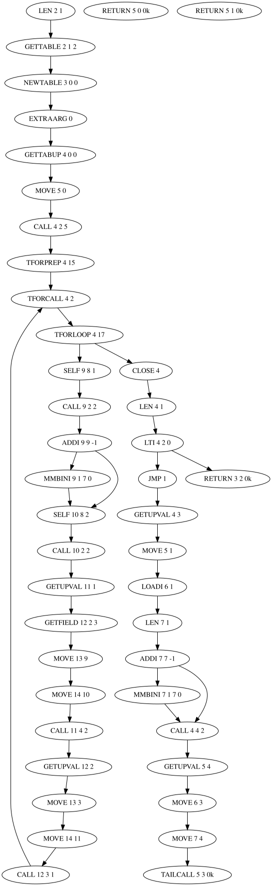

[![DeepWiki][DeepWiki_Logo]][DeepWiki_Repo] will answer your questions

<table>
  <tr>
    <th colspan=3 align="center">Rimae</th>
  </tr>
  <tr>
    <td>
      <table>
        <tr>
          <th>Created</th>
          <td>2026-07</td>
        </tr>
        <tr>
          <th>Updated</th>
          <td>2026-09-15</td>
        </tr>
        <tr>
          <th>Code size</th>
          <td>&lt; 100 K</td>
        </tr>
        <tr>
          <th>License</th>
          <td>LGPL3</td>
        </tr>
      </table>
    </td>
    <td align="center">
      Generates control flow graphs for any valid Lua
      (5.3, 5.4, 5.5) source code.
    </td>
    <td>
      <table>
        <tr>
          <th>Input</th>
          <th>Output</th>
        </tr>
        <tr>
          <td>
            <code>.lua</code><br>
            <code>.luac</code>
          </td>
          <td>
            <code>.svg</code><br>
            <code>.mmd</code><br>
            <code>.dot</code><br>
            <code>.tgf</code><br>
            <code>.is</code>
          </td>
        </tr>
      </table>
    </td>
  </tr>
</table>


## Workflow and details

```
$ lua generate_callgraphs_lua.lua
Creates VM instruction call graphs for Lua code

Usage: <lua_file_name> <output_dir>

Careful, we will recreate <output_dir>!

-- Martin, 2026-09
```

Okay, we have some Lua source file. ([Sample][sample_lua])

We will place results in given directory. (We treat that directory as
our own "child", no other data there is tolerated.)

We will use stock Lua compiler `luac` to get VM (virtual machine)
instructions from source code:

  * `.is` ([Itness][Itness], strings tree) ([Sample][sample_listing])

    VM instructions listing. Human- and machine-friendly format.

We will create callgraphs from that instructions and export them in following formats:

  * `.tgf` ("trivial graph format" for [`yEd`][yEd]) ([Samples][samples_tgf])

    Machine-friendly format. Graphs can be loaded in `yEd` and and manually processed.

  * `.dot` ("DAG of tomorrow" for [`Graphviz`][Graphviz] package) ([Samples][samples_dot])

    Human- and machine-friendly format. `Graphviz` can layout them to `.svg`.

  * `.mmd` ([`Mermaid`][Mermaid]) ([Samples][samples_mmd])

    Hyped layouter for drawing in browser.

    JavaScript code from `github.com` is executed in your browser
    to render them as images.

    Maybe Microsoft will allow you to directly save that images in future.

    You can't embed it in `markdown` in `github.com` as file link.
    However you can embed their code in `markdown` by ` ```mermaid`.

We will use `dot` program from `graphviz` package to layout `.dot` graphs:

  * `.svg` ("simple vector graphics" for many programs) ([Samples][samples_svg])

    XML-based format for vector images.

    You can embed it in `markdown`: ``:

    


## Shipment

Repository contains

  * Compiled code in [`deploy/`][deploy]
  * Sample output in [`output/`](output/)
  * Sample input in [`samples/test.lua`](samples/test.lua)
  * Complete source code in [`src/`][src]
  * Rebuild script and tools in [`builder/`](builder/)


## Requirements

  * Linux
  * Lua 5.5 (or 5.4, 5.3) (`sudo apt install lua`)
  * `graphviz` package for `dot` program (`sudo apt install graphviz`)


## Typical usage

  * Save [`generate_callgraphs_lua.lua`][compiled_tool] from
    [`deploy/`][deploy]

  * Add it to your programs (f.e. place it in `~/bin/`)

  * Try it on bigger code corpus

    For example try it on itself. There are some graphs worth seeing.


## Modification

  * Modify files in [`src/`][src]


## Rebuilding

  * Clone [`workshop`][workshop] repo
  * Checkout it to date near "Updated" date from stats plate (at header of this Readme)
  * Modify `package.path` in [`builder/create_deploy.lua`][create_deploy]
    so it can find your cloned `workshop` repo
  * Run [`builder/rebuild.sh`][rebuild]


## Notes

  * "Rima" is Latin term for Moon channel. Plural is "rimae"

    Name was [suggested][name_suggestion] by `Regan Ryan` in Lua maillist `2026-09-09`.

  * There can be orphaned VM instructions in graphs. They are present
    in `luac -l` listing we are using. We're not going to eliminate them,
    our scope is show what is present, not generating nice graphs.

  * "Callgraph" term is a bit misleading

    We are making static callgraph for VM instructions. On higher level
    it's called "flowchart".

  * It works for compiled and stripped Lua bytecode

    You don't need original sources.

  * Some functional extensions are not planned

    Someone may think that adding node coloring and shaping features
    is improvement. We don't agree.

    If you want nice graph -- load `.tgf` into `yEd`. Apply one of it's
    layouts. Do shaping and coloring there as you please.

  * Basically each function is "closure" and stored in separate file

    Building one graph for all closures is possible (and interesting)
    but result will be beyond our comprehension.

    Try tool on `builder/reformat_lua`. It will create over 500 graphs.
    Imagine them all merged into one graph. Not practical.


## See also

  * [`workshop`][workshop] -- my personal framework
  * [`contents`][contents] -- my other projects

[DeepWiki_Logo]: https://deepwiki.com/badge.svg
[DeepWiki_Repo]: https://deepwiki.com/martin-eden/Lua-Callgraph

[sample_lua]: samples/test.lua
[sample_listing]: output/listing.is
[samples_tgf]: output/tgf/
[samples_dot]: output/dot/
[samples_svg]: output/svg/
[samples_mmd]: output/mmd/

[Itness]: https://github.com/martin-eden/Lua-Itness
[yEd]: https://www.yworks.com/products/yed
[Graphviz]: https://graphviz.org/download/
[Mermaid]: https://mermaid.ai

[src]: src/
[deploy]: deploy/
[compiled_tool]: deploy/generate_callgraphs_lua.lua
[create_deploy]: builder/create_deploy.lua
[rebuild]: builder/rebuild.sh

[name_suggestion]: https://groups.google.com/g/lua-l/c/3x3Vu82RThA/m/3xCvwUemEgAJ

[workshop]: https://github.com/martin-eden/workshop
[contents]: https://github.com/martin-eden/contents
